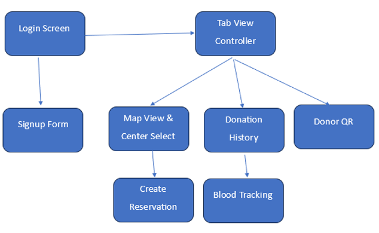
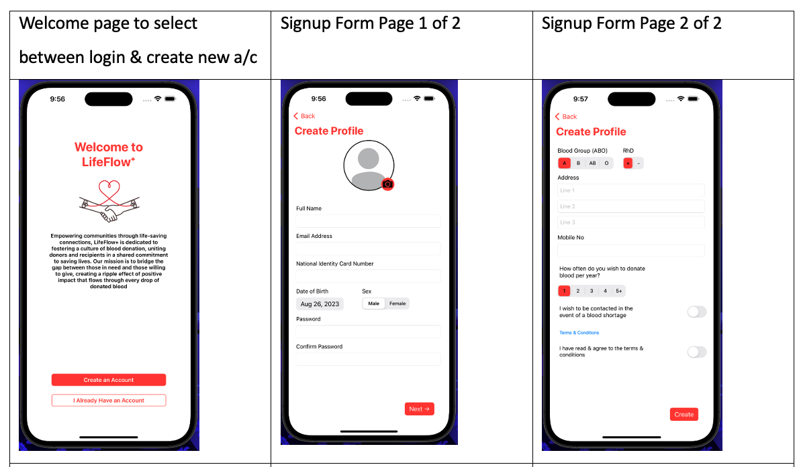
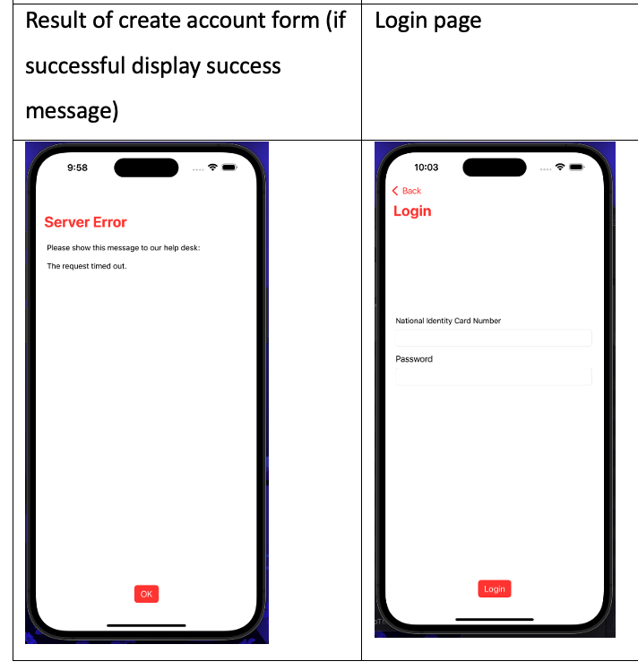
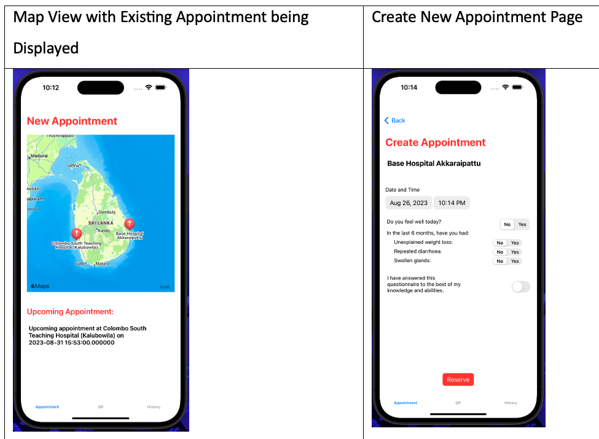
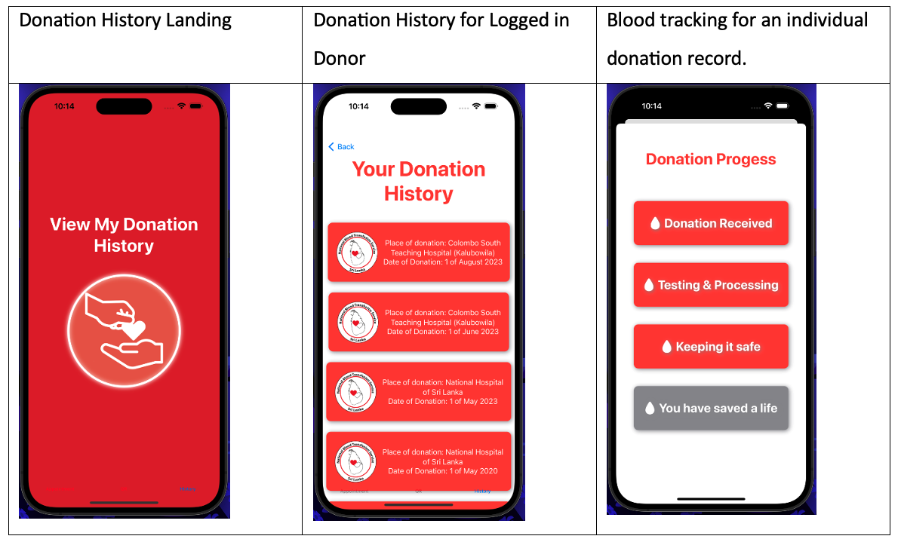
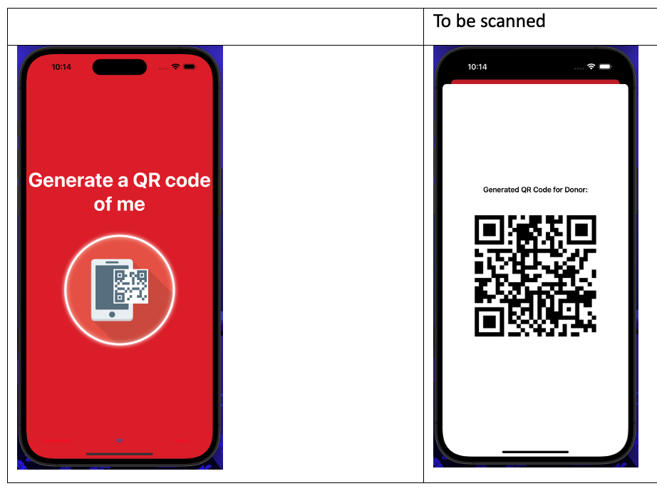

# About

LifeFlow is a project to digitize the Sri Lankan blood donation process.
It was developed by me and my friends Vishwa (https://www.linkedin.com/in/vishwa-panapitiya/) and Ruvin (https://www.linkedin.com/in/ruvin-kularathne-889098a1/).
The entire solution consists of:
- An iOS app for donors to register, book donation appointments and track historical donations, as well as see the journey of their blood (from storage to patient).
- A MS SQL DB and PHP backend
- An iOS app for hospital staff to handle donations and donors (handled entirely by Vishwa and is not included in this repo).

# Donor App Flow

# Registration and Login Views

# Appointment Creation Views

# History and Tracking Views

# Dependencies
- CodeScanner 2.3.3
- IQKeyboardManagerSwift 6.5.12
